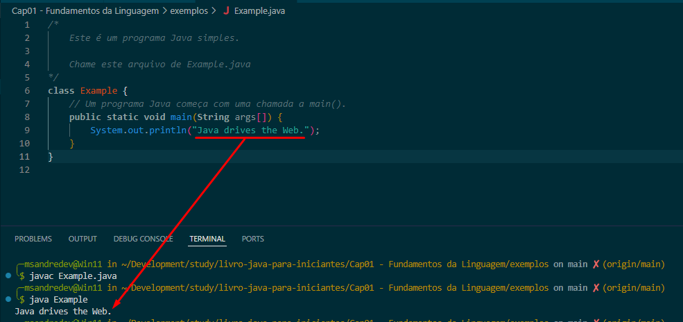

### Capítulo 01 - Fundamentos da Linguagem

Um arquivo de código-fonte Java deve ter a extensão `.java` e o nome da classe deve ter o mesmo nome desse arquivo, incluindo maiúsculas e minúsculas pois o Java diferencia a capitalização (chamado de CamelCase).

Nesse arquivo deve conter todo o código Java necessário, e para que seja executado, o código deve estar dentro do método principal chamado `main()`.

Abaixo, segue o código do exemplo:

```java
/*
    Este é um programa Java simples.

    Chame este arquivo de Example.java
*/
class Example {
    // Um programa Java começa com uma chamada a main().
    public static void main(String args[]) {
        System.out.println("Java drives the Web.");
    }
}
```

Exemplo:
1. Insira o programa
2. Compile o programa
3. Execute o programa



Se tudo estiver correto, ao compilar o programa com o comando `javac Example.java` será criado um novo arquivo pelo próprio compilador do Java chamado de `Example.class`. 

Este é o arquivo compilado em _bytecode_ que será lido pela JVM.

### Lembrete! 
> o bytecode `.class` não é código executável. Ele deve ser executado através da Java Virtual Machine, que é o interpretador de código Java.

Após compilar, para executar o código é necessário executar o comando `java Example`. O que será mostrado dependerá do que o programa foi programado para fazer. Nesse caso exibirá apenas uma mensagem:

_Java drives the Web._


### Comentários
O código que estiver dentro de um comentário não será executado e servirá apenas como informativo para o desenvolvedor:

```java
/* 
    Este é um comentário de múltiplas linhas
    e NÃO será executado
    pelo compilador do Java.
*/ 

// Este é um comentário de uma linha só e NÃO será executado pelo compilador do Java.
```