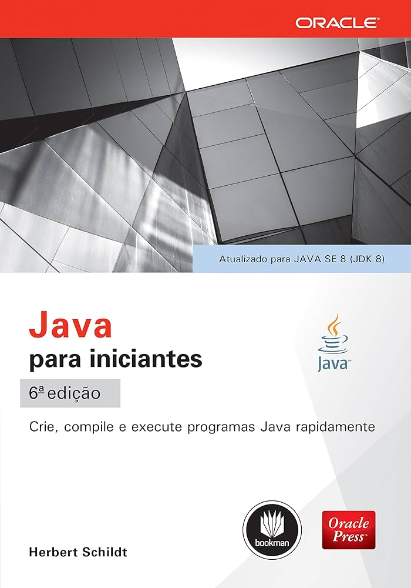

# Um estudo sobre o livro "Java para Iniciantes - 6a edição"

Criei este repositório com o intuito de adicionar os exemplos, exercícios, desafios e anotações referentes ao meu estudo com base na leitura do livro "Java para Iniciantes - 6ed - Herbert Schildt".

### Capa do livro

## Índice
[Cap01 - Fundamentos da linguagem Java](Cap01%20-%20Fundamentos%20da%20Linguagem/README.md)